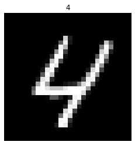

# Learning Numbers With Neural Networks

- Using Jupyter Notebooks and the TensorFlow Library to create machine learning models for classifying handwritten digital images.
- Uses MNIST dataset of handwritten digits.

## 3 Sets of 5 experiments
1. First Set using raw (unchanged) data.
2. Second Set using scaled data.
3. Third Set using normalized data.

### Each of the 5 experiments had the following characteristics (Control variables):
- Categorical-Cross-Entropy loss function.
- Adam optmizer.
- 10 iterations (epochs).
- 4 dense layered machine learning model.
- Layer 1 (input layer) of 784 nodes.

### For Each of the 5 experiments, these were the independent variables:
- Experiment 1: 
  - Layer 2: 4 nodes, linear activation function. 
  - Layer 3: 4 nodes, linear activation function.
  - Layer 4: 10 nodes, linear activation function.
- Experiment 2:
  - Layer 2: 4 nodes, relu activation function.
  - Layer 3: 4 nodes, relu activation function.
  - Layer 4: 10 nodes, softmax activation function.
- Experiment 3:
  - Layer 2: 6 nodes, relu activation function.
  - Layer 3: 6 nodes, relu activation function.
  - Layer 4: 10 nodes, softmax activation function.
- Experiment 4:
  - Layer 2: 10 nodes, relu activation function.
  - Layer 3: 10 nodes, relu activation function.
  - Layer 4: 10 nodes, softmax activation function.
- Experiment 5:
  - Layer 2: 100 nodes, relu activation function.
  - Layer 3: 100 nodes, relu activation function.
  - Layer 4: 10 nodes, softmax activation function.

### Conclusion
- Normalized data with relu and softmax activation functions gave most accurate results. 
- Increasing the number of nodes at each layer improves accuracy only slightly.